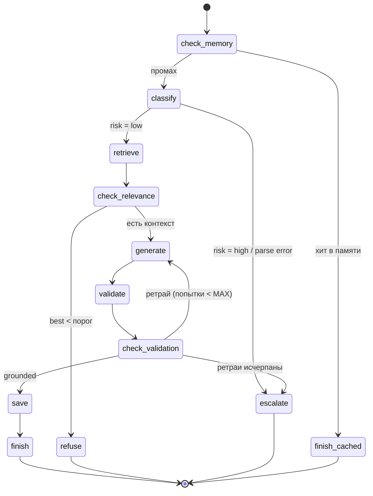

# DZ_5: Управляемый сценарий — пайплайн тикета поддержки на графе состояний

Агент обрабатывает запрос пользователя как **сценарий из 5 шагов** с точками
ветвления (проверок), реализованный в виде **графа состояний**, с **векторным
поиском контекста** (Qdrant, паттерн DZ_4) и **граф-памятью Q&A**:

1. **Последовательность** — 5 рабочих шагов: `classify → retrieve → generate →
   validate → save`.
2. **Управление логикой** — 4 точки ветвления: хит в памяти, высокий риск,
   «контекста недостаточно», «ответ не подтверждён» (ретрай / эскалация).
3. **Векторный контекст** — документы БЗ эмбедятся (`embeddings.create` через
   тот же LLM-сервер) и ищутся по косинусу в Qdrant (Docker, `localhost:6333`).
4. **Память** — граф обработанных вопросов `memory/qa.json` (узлы `qa` + рёбра
   к использованным документам); повторный вопрос отвечается из памяти
   без обращения к LLM.

## Схема (граф состояний)



## Структура

```
agent.py              # движок графа состояний, сценарий, Qdrant-память, LLM, CLI, selftest
context/kb.json       # база знаний: 7 документов (формат DZ_3)
memory/qa.json        # граф-память Q&A (заполняется при прогонах)
docker-compose.yml    # Qdrant (Docker, порт 6333)
requirements.txt      # openai, python-dotenv, qdrant-client (pinned)
.env.example          # шаблон конфигурации
plan.md               # план реализации
```

## Требования

- Python 3.12+ (разработано и проверено на 3.13).
- OpenAI-совместимый LLM-сервер (LM Studio, дефолт `http://localhost:1234/v1`)
  с чат-моделью (например, `google/gemma-4-12b-qat`) и embedding-моделью
  (например, `text-embedding-qwen3-embedding-0.6b`).
- Qdrant — Docker-контейнер на `localhost:6333`:

  ```bash
  docker compose up -d            # или: docker run -d --name qdrant -p 6333:6333 qdrant/qdrant
  ```

- Если Qdrant или LLM недоступны — агент не падает: поиск деградирует до
  мок-памяти (детерминированные псевдо-векторы), на LLM — дружелюбное
  `[ошибка LLM]`. Selftest работает вообще без LLM, Qdrant и сети.

## Установка

```bash
cd DZ_5
python3.13 -m venv .venv
.venv/bin/pip install -r requirements.txt
cp .env.example .env          # затем вписать LLM_MODEL / EMBEDDING_MODEL из LM Studio
docker compose up -d          # Qdrant
```

## Запуск

```bash
# интерактивный режим (exit/quit/выход — выход)
.venv/bin/python agent.py

# один вопрос
.venv/bin/python agent.py "когда дедлайн по домашним заданиям?"

# один вопрос с путём по состояниям
.venv/bin/python agent.py --show-trace "когда дедлайн по домашним заданиям?"

# сценарный прогон: 4 запроса, покрывающие все ветки графа
.venv/bin/python agent.py --demo

# самодиагностика без LLM, Qdrant и сети (7 проверок)
.venv/bin/python agent.py --selftest
```

> Чтобы прогнать `--demo` с чистого листа, сбросьте `memory/qa.json` в
> `{"nodes": [], "edges": []}` — иначе прогон 1 станет хитом в памяти.

## Пример выполнения (живой прогон `--demo`, Qdrant запущен)

```text
Эмбеддинги: text-embedding-qwen3-embedding-0.6b (dim=1024)
Qdrant: dz5_memory загружено (7 документов)
Агент DZ_5 | БЗ: 7 документов | память: 0 обработанных вопросов | модель=google/gemma-4-12b-qat
Демо: 4 прогона (все ветки графа состояний)

===== Прогон 1/4: happy path: полный путь + сохранение в память =====
Запрос: Как получить сертификат об окончании курса?
Путь по состояниям: check_memory → classify → retrieve → check_relevance → generate → validate → check_validation → save → finish
[answered]
Чтобы получить сертификат об окончании курса, необходимо выполнить следующие условия:
1. Сдать все домашние задания.
2. Пройти итоговую работу на минимальный проходной балл.

Получить сертификат можно в личном кабинете после завершения курса, обычно в течение 5 рабочих дней.

[источники: doc-certificate]
Источники: doc-certificate, doc-enroll, doc-mentor
Сохранено в память (qa.json).

===== Прогон 2/4: нет контекста → ветка refuse =====
Запрос: Какая погода в Токио?
Путь по состояниям: check_memory → classify → retrieve → check_relevance → refuse
[refused]
В базе знаний не нашлось релевантной информации. Попробуйте переформулировать вопрос или обратитесь к ментору.

===== Прогон 3/4: высокий риск → ветка escalate =====
Запрос: Я хочу на вас подать в суд и причинить вред себе.
Путь по состояниям: check_memory → classify → escalate
[escalated]
Передаю ваш запрос оператору поддержки.
Причина: high_risk

===== Прогон 4/4: повтор вопроса 1 → хит в памяти =====
Запрос: Как получить сертификат об окончании курса?
Путь по состояниям: check_memory → finish_cached
[answered_cached]
(ответ из памяти) Чтобы получить сертификат об окончании курса, необходимо выполнить следующие условия:
1. Сдать все домашние задания.
2. Пройти итоговую работу на минимальный проходной балл.

Получить сертификат можно в личном кабинете после завершения курса, обычно в течение 5 рабочих дней.

[источники: doc-certificate]
Источники: doc-certificate, doc-enroll, doc-mentor
```

После прогона 1 `memory/qa.json` содержит узел `qa-1` (вопрос → ответ) и рёбра
`qa-1 → doc-*` (relation «использует»). Если Qdrant остановлен, перед заголовком
появляется `[ошибка Qdrant] ... Использую мок.` — и прогон продолжается на
мок-памяти (с реальными эмбеддингами, если LLM доступен).

## Архитектура

```
CLI (agent.py): интерактив | "вопрос" | --demo | --selftest | --show-trace
  |
  v
make_vector_memory(client, kb)
  |  LLM-эмбеддинги (embeddings.create) → QdrantMemory (cosine, dz5_memory)
  |  Qdrant недоступен → MockQdrantMemory (косинус в памяти, те же эмбеддинги)
  |  LLM недоступен → детерминированные псевдо-векторы (_random_embed)
  |
  v
build_scenario(chat, kb, memory, qmem, qa_path, config)  →  Workflow(12 состояний)
  |
  |  Workflow.run(ctx): entry → action(ctx) → route(ctx) → ... → END
  |  каждый шаг пишется в ctx.trace; гард MAX_STEPS от зацикливания;
  |  исключение в action → escalate (step_error:<state>), а не падение
  |
  |  5 рабочих шагов:      classify → retrieve → generate → validate → save
  |  (retrieve — векторный поиск top-3 по Qdrant/моку)
  |  4 точки ветвления:    check_memory / classify(risk) / check_relevance /
  |                        check_validation (ретрай-цикл с лимитом)
  |  4 терминальных:       finish / refuse / escalate / finish_cached
  |
  v
AgentResult(outcome, message, sources, escalated_reason, memory_saved, trace)
```

Ключевые решения:

- **Движок отделён от сценария.** `Workflow` знает только «иди по графу с
  гардом по шагам»; конкретный сценарий — 12 замыканий (`action` + `route`)
  в `build_scenario`. Добавить шаг/ветвление = добавить состояние,
  без изменения движка.
- **Ветвление — часть графа, а не if-ы в цикле.** Каждое условие — отдельное
  состояние-«проверка» с функцией маршрутизации; trace наглядно показывает,
  какие условия сработали.
- **Векторный контекст (паттерн DZ_4).** Документы БЗ upsert-ятся в Qdrant
  (cosine, payload `doc_id/title/text`), запрос эмбеддится тем же сервером.
  `QdrantMemory` и `MockQdrantMemory` имеют один интерфейс — сценарий не знает,
  где лежат векторы.
- **Память как граф.** `GraphMemory` (портирована из DZ_4): узлы `qa`
  (label = вопрос, text = ответ) и рёбра к использованным документам.
  В файл сохраняются только qa-узлы — doc-узлы перечитываются из `kb.json`,
  данные не дублируются.
- **Лимит ретраев + гард по шагам.** `check_validation → generate` — реальный
  цикл в графе: выход из него либо по `grounded=true`, либо по исчерпании
  `MAX_VALIDATION_RETRIES`, либо по `MAX_STEPS`.
- **Деградация в безопасную сторону.** Qdrant недоступен → мок-память;
  эмбеддинги недоступны → псевдо-векторы (поиск → почти нулевые сходства →
  ветка refuse); JSON от LLM с `_parse_error` → `escalate
  (classification_failed)`; ошибка в состоянии → `escalate(step_error:<state>)`;
  LLM недоступен → `[ошибка LLM]`, а не traceback.
- **Selftest без инфраструктуры.** `FakeLLM` (детерминированная заглушка с
  режимами `default`/`risky`/`ungrounded`/`loop`) + `MockQdrantMemory` с
  TF-IDF-эмбеддером: все ветки графа проверяются без LLM, без Qdrant,
  без сети, в tmp-каталоге.

## Конфигурация (`.env`)

| Переменная | Дефолт | Назначение |
|---|---|---|
| `LLM_BASE_URL` | `http://localhost:1234/v1` | адрес OpenAI-совместимого сервера |
| `LLM_API_KEY` | `lm-studio` | ключ (для LM Studio — любое непустое) |
| `LLM_MODEL` | `google/gemma-4-12b-qat` | Model Identifier чат-модели |
| `LLM_REQUEST_TIMEOUT_SECONDS` | `120` | таймаут запроса к LLM |
| `EMBEDDING_MODEL` | `text-embedding-qwen3-embedding-0.6b` | Model Identifier embedding-модели |
| `EMBEDDING_DIM` | `1024` | размерность вектора (должна совпадать с моделью и коллекцией) |
| `QDRANT_URL` | `http://localhost:6333` | адрес Qdrant |
| `QDRANT_COLLECTION` | `dz5_memory` | имя коллекции (создаётся автоматически, cosine) |
| `KB_FILE` | `context/kb.json` | база знаний (документы для векторного поиска) |
| `QA_MEMORY_FILE` | `memory/qa.json` | граф-память Q&A |
| `RELEVANCE_THRESHOLD` | `0.3` | порог косинусного сходства (ниже — refuse) |
| `MEMORY_HIT_THRESHOLD` | `1.5` | порог keyword-совпадения с вопросом из памяти (выше — finish_cached) |
| `MAX_VALIDATION_RETRIES` | `2` | сколько раз перегенерировать после провала валидации |
| `MAX_STEPS` | `15` | гард: максимум состояний за один прогон |
| `LOG_LEVEL` | `ERROR` | уровень логирования |

## Selftest (без LLM и Qdrant)

`.venv/bin/python agent.py --selftest` — 7 проверок, LLM-сервер, Qdrant и сеть
**не нужны** (FakeLLM + мок Qdrant + детерминированный TF-IDF эмбеддер):

1. граф валиден: все 12 состояний достижимы, переходов в «фантазии» нет;
2. success path: точный trace `… → save → finish`, ответ, сохранение в память,
   ребро `qa → doc-certificate`;
3. ветка «нет контекста»: отказ, память не пополняется;
4. провал валидации: 1 попытка + 2 ретрая → эскалация `grounding_validation_failed`;
5. высокий риск: эскалация после классификации, без генерации;
6. хит в памяти: ответ из памяти, счётчик генераций не вырос;
7. гард `MAX_STEPS`: бесконечный ретрай останавливается.

Успех = `SELF-TEST: все проверки пройдены.` и код возврата 0.